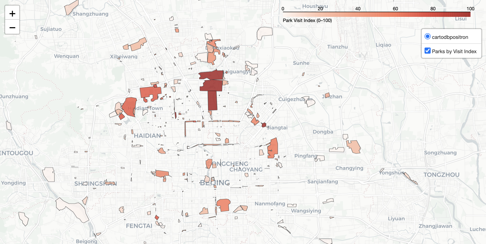

# H3 Index Demo

A simple demo that uses the Uber H3 grid with high frequency GPS data. The goal is to build an index that reflects the usage of Beijing parks among users in the [Microsoft Geolife dataset](https://www.microsoft.com/en-us/download/details.aspx?id=52367). Park boundaries come from OpenStreetMap.

---

## What this project shows

- How to get H3 hexagons at an appropriate resolution for locations with shapefile polygons
- How to map GPS points to H3 hexagons
- How to build a simple  usage index and visualize results

---

## What is H3

H3 is a global grid system made of hexagons. It assigns every location on Earth to a hex id. Each level of detail is called a resolution. Low resolutions have big hexes. High resolutions have small hexes. See the [H3 documentation](https://h3geo.org/docs/core-library/restable#appendix-methodology) for more details.

Choosing the right resolution matters. If the hex is too big, you lose detail. If the hex is too small, the data gets sparse and noisy. In a real project you would test several resolutions and see how sensitive the analysis is to the choice of index.

---

## Data used

- **Microsoft Geolife Trajectories**. Public GPS traces for a small set of users in Beijing.
- **OpenStreetMap parks**. Polygons for park boundaries in Beijing.

Note: The Geolife data has routes for walking, biking, and driving. It does not necessarily reflect time spent at a place. Real phone data would reflect actual time spent in a more accurate way.

---

## Limitations of this demo

- **Small user base**. Geolife has few users. You do not need big data tools like PySpark for this demo. A real project with millions of users should use Spark or Databricks.
- **Phone sensor details**. Real mobile data typically includes sensor data and GPS accuracy. You can use these to estimate location more accurately and model error. Monte Carlo methods can be used to estimate the error. 
- **Routes vs stays**. The Geolife data is made up of routes and may over count passing through a park. We reduce this by using time thresholds. Mobile location data would be more accurate for detecting park visits and time spent at the park.

---

## Repository contents

Three notebooks form the pipeline:

1. **01\_get\_location\_hex\_ids.ipynb**

   - Loads park polygons from OpenStreetMap
   - Picks an H3 resolution using the range of polygon sizes
   - Creates H3 hex ids that cover each park (polyfill)
   - Calculates the overlap of the hex id area with the park polygon, discarding hexes with small overlap
   - Saves park hex tables for joins later
   - View Public Notebook in Colab: [Link](https://colab.research.google.com/drive/1rZvssFyjJnlvEtnUJRQuDkRv2JN5mLD7?usp=sharing)

2. **02\_process\_high\_frequency\_gps.ipynb**

   - Loads Geolife GPS points
   - Calculates per point time deltas
   - Assigns each GPS point to an H3 hex id
   - Flags points that fall inside any park hex
   - Aggregates stay time by user, trajectory, and park
   - Saves a tidy file for indexing
   - View Public Notebook in Colab: [Link](https://colab.research.google.com/drive/1sV1vIIo9NutggM9nBXfpLEvsdQ0sFdx1?usp=sharing)

3. **03\_create\_index.ipynb**

   - Reads the tidy time-by-park data
   - Builds a simple index of park use
   - Joins results back to park polygons
   - Makes a quick interactive map for review
   - View Public Notebook in Colab: [Link](https://colab.research.google.com/drive/1OzXjVumjSTyG-96Yrby8SH_zTWeWrE8F?usp=sharing)

---

## Running in Google Colab

- The notebooks are designed for Colab with a CPU runtime.
- The Geolife zip is loaded from a public Google Drive folder into the VM during the run.
- Steps:
  1. Add this repo folder to your Google Drive.
  2. If you save the repo folder to a subfolder in your drive, change the directory in the set up section of each notebook

If Colab asks for Drive access, grant permission so the notebooks can read and write files.

---

## Outputs

- **CSV**: time by user, trajectory, and park
- **CSV**: park level index table
- **GeoJSON**: parks with index fields for mapping
- **HTML map**: quick view of top parks by index

---

## Ideas for future work

- Test several H3 resolutions and report sensitivity
- Model error of probability the user is in the park using Monte Carlo methods using the hexagon overlap
- Create additional indices that use length of visit (time used) and geographic diversity of users
- Compare parks by time of day and day of week
- Move the pipeline to Spark or Databricks

---

## Requirements

- Python 3.10+
- Packages used: `h3`, `pandas`, `geopandas`, `shapely`, `folium`, `branca`, and common scientific stack
- Google Colab or a local setup with the packages above

---

## Credits

- Microsoft Research for the Geolife dataset
- OpenStreetMap contributors for park boundaries
- Uber for the H3 grid system
- ChatGPT for debugging

---

## License

**Code:** PolyForm Noncommercial License 1.0.0. You may use, copy, and change the code for non-commercial use. Any commercial use needs my written OK.

**Data:**

- OpenStreetMap data is under the ODbL 1.0. Follow its attribution and share alike rules.
- Microsoft Geolife dataset must be used under its original terms. Cite the dataset page and authors when you share results.